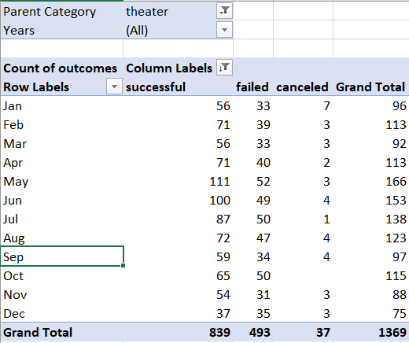
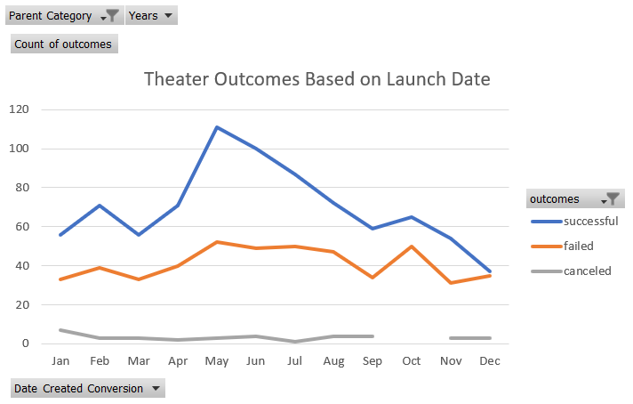
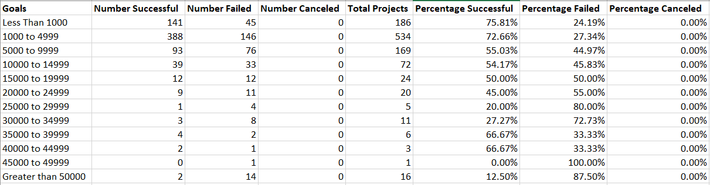
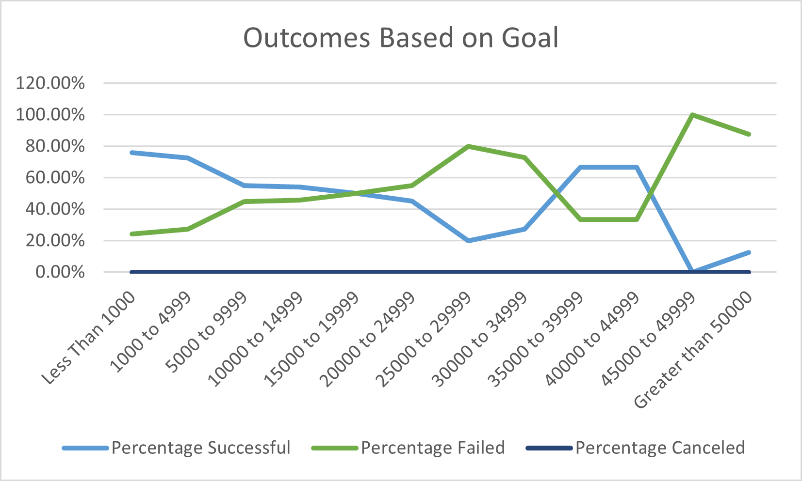

# An Analysis of Kickstarter Campaigns
##### Module 1 - Performing analysis on Kickstarter data to uncover trends
### Overview of Project
  Louise, the client and playwright of *Fever*, did not meet her fundraising goal for her play on Kickstarter by a small margin.  She wishes to examine campaign outcomes of other theater projects funded through Kickstarter based upon launch dates and funding goals to determine whether or not she can alter either variable to have success in a future fundraising campaign.  The dataset analyzed consists of 1,394 Kickstarter theater campaigns between 2010 and 2017.
### Analysis and Challenges
  Two analyses were run on the dataset; 'Outcomes Based on Launch Date' and 'Outcomes Based on Goals'.  
##### Analysis of Outcomes Based on Launch Date 
A pivot table was created to determine the count of campaign outcomes (successful, failed, and canceled) based upon their creation date. Currently live campaigns were excluded from the results. The variable 'Parent Category' was used to filter for only theater projects. 

Subsequently, the pivot table was used to create a line chart to visualize the findings. 

##### Analysis of Outcomes Based on Goals
A table was created with goal range dollar figures on the y-axis and counts and percentages of outcomes (successful, failed, and canceled) on the x-axis. The full dateaset was filtered to only show results for the subcategory "plays". The COUNTIFS() function was then used to populate the table with the number of outcomes for each goal range.

The percentage columns were then used to create a line chart of the outcomes vs the goal ranges.

##### Challenges and Difficulties Encountered
